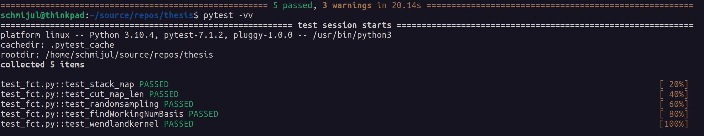

# Stufy Thesis Repo

## Setup
To Run all the cripts it's easiest to clone the entire Repo

    git clone git@github.com:JulianSchmidt96/thesis.git

    cd thesis

## Install Dependencies
Since a few different Libraries are used in the thesis, it's easiest to install them all at once.

    pip3 install -r requirements.txt

## Run Tests

Since a lot of debbuging happened I created a script named test_fct.py, which tests a few of the main data processing functions.
To Run it type:

    pytest

If everything works pytest will show something like this:

    
